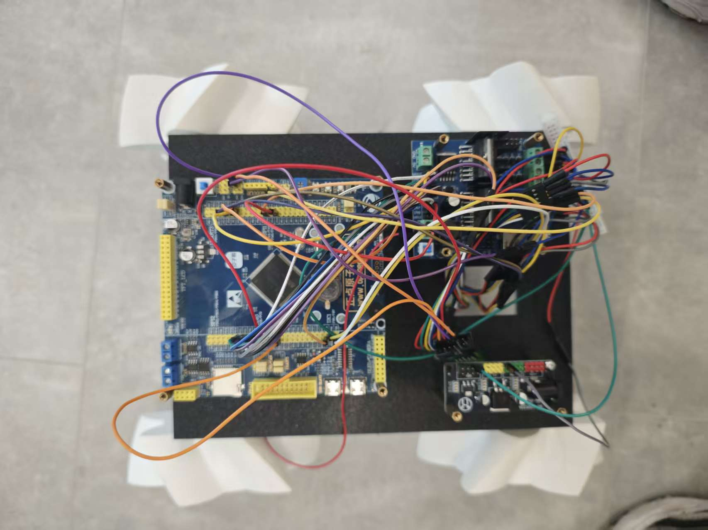

# 四电机控制与速度监测

## 项目目标

使用 STM32F103ZET6 完成四个直流电机的 PWM 控制、方向控制、编码器测速和基础速度闭环，为后续 ROS 麦克纳姆轮机器人提供底层驱动。

## 软件环境

- STM32CubeMX 6.18.1
- STM32CubeIDE
- STM32 HAL
- FreeRTOS

## 工程入口

- CubeMX 配置：[motor4_speed_monitor.ioc](motor4_speed_monitor.ioc)
- 主程序：[Core/Src/main.c](Core/Src/main.c)
- 电机控制：[Core/Src/motor.c](Core/Src/motor.c)
- 电机控制接口：[Core/Inc/motor.h](Core/Inc/motor.h)

## 当前功能状态

| 功能 | 状态 | 记录状态 |
| --- | --- | --- |
| 四路 PWM 输出 | 已完成 | PWM 功能已验证，频率和占空比数值待补 |
| 四个电机方向控制 | 已完成 | 已结合最终安装方向调整，具体方向表待补 |
| 编码器初始化和计数 | 已完成 | 编码器方向符号已记录在代码中 |
| 基础速度计算 | 已完成 | 计数周期、单位换算和实测数据待补 |
| 速度闭环 / PID | 已完成基础调试 | 最终车体参数和调参过程待补 |
| 串口数据输出 | 已完成 | 输出内容和示例数据待补 |
| 串口调参基础 | 已完成 | 命令格式和参数范围待补 |

## 硬件记录

### 主控与驱动

MCU：STM32F103ZET6

电机驱动：L298N 四路电机驱动模块

### 电机与供电

电机：JGY-370 DC12V 10RPM

电源：阳河 12V 锂电池

电源模块：DC 多路电源转换模块

### 机械结构演进

第一版麦克纳姆轮：

第二版麦克纳姆轮：

打印车架：

第一版成型小车：

第二版成型小车：

### 接线和方向推导

接线图手稿：

麦克纳姆轮轮子朝向推导：

第一版小车运行视频：[查看视频](../图片层/第一版小车动起来.mp4)

## 测试记录

以下内容只记录目前已完成的验证范围；没有精确测量值的项目明确标记为待补，不把功能完成误写成数据完整。

| 测试内容 | 当前结果 | 待补数据或说明 |
| --- | --- | --- |
| 四路 PWM 输出 | 已完成 | PWM 频率、定时器时钟、占空比范围 |
| 四电机方向 | 已完成 | 最终安装后的 M1-M4 方向对照表 |
| 编码器计数 | 已完成 | 每圈脉冲数、计数周期、正负方向 |
| 基础速度计算 | 已完成 | 目标速度、实际速度、误差和单位换算 |
| 速度闭环 / PID | 已完成基础调试 | 最终车体装配后的 PID 参数和曲线 |
| 串口数据输出 | 已完成 | 一组实际串口输出示例 |
| 串口调参 | 已完成基础功能 | 命令格式、参数范围和使用步骤 |

## 关键经验

电机单独运行时调通的方向和 PID 参数，不能直接认为适用于最终车体。电机装到车架后，需要结合机械安装方向重新核对电机方向、编码器符号和控制参数。详细记录见[调试与问题记录](debuge和问题记录.md)。

## 重新导入工程

在 STM32CubeIDE 中选择 `File -> Import -> Existing Projects into Workspace`，选择 `motor4_speed_monitor` 目录，导入 `.project` 文件对应的工程即可。

重新生成 CubeMX 代码前，确认自己的代码位于 `USER CODE` 区域或独立的业务文件中，避免被自动生成代码覆盖。
