# 四电机控制与速度监测

## 计划
从零搭建一个ros可遥控的麦轮机器人

## 软件环境

- STM32CubeMX 6.18.1
- STM32CubeIDE
- STM32 HAL
- FreeRTOS

## 工程入口

- CubeMX 配置：[motor4_speed_monitor.ioc](motor4_speed_monitor.ioc)
- 主程序：[Core/Src/main.c](Core/Src/main.c)
- 电机控制：[Core/Src/motor.c](Core/Src/motor.c)
- 电机控制接口：[Core/Inc/motor.h](Core/Inc/motor.h)

## 硬件记录

请补充实际使用的电机驱动板、电机型号、电源电压、编码器类型和接线图。

MCU：STM32F103ZET6
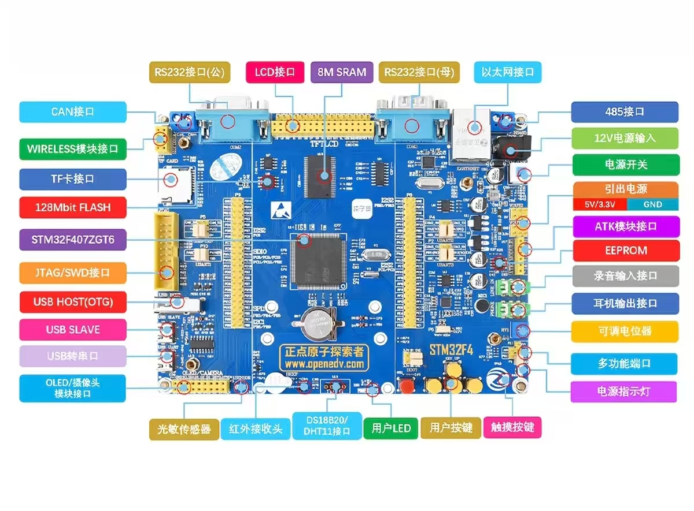
电机驱动：L298N四路电机驱动模块
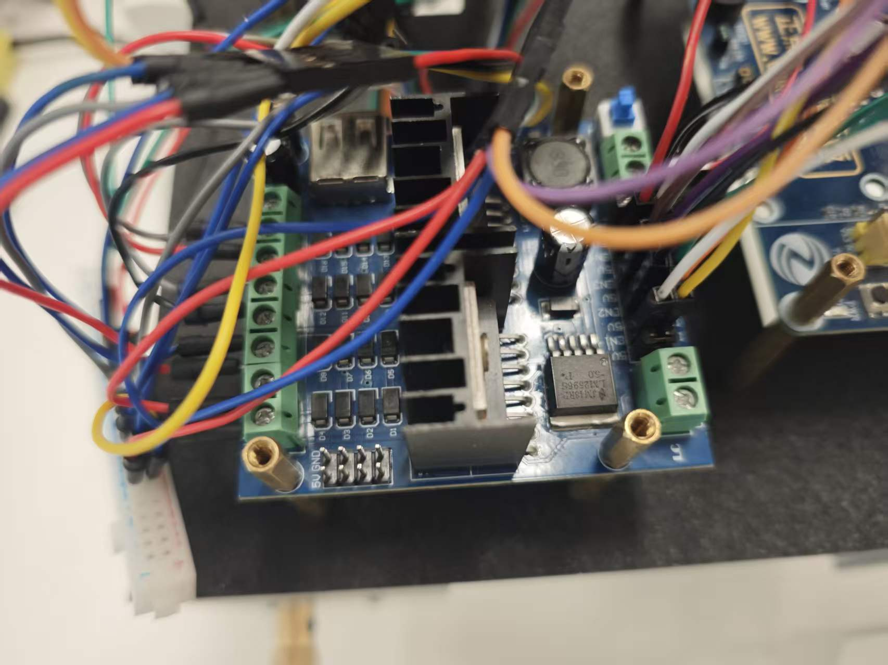
电机：JGY-370 DC12V10RPM
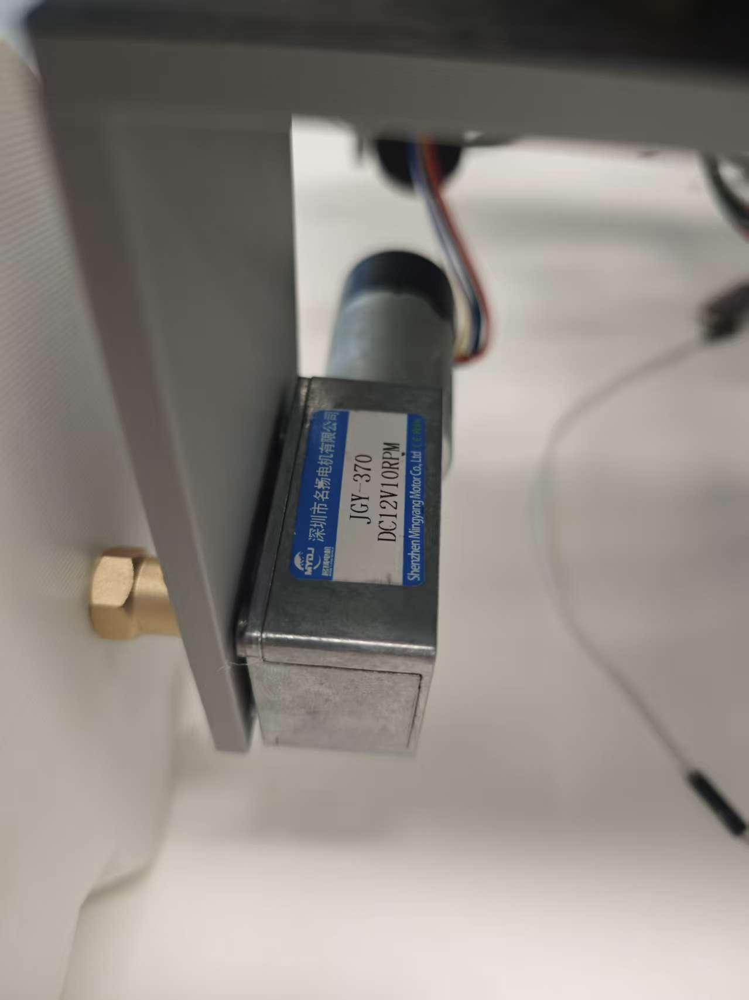
电源：阳河12v锂电池
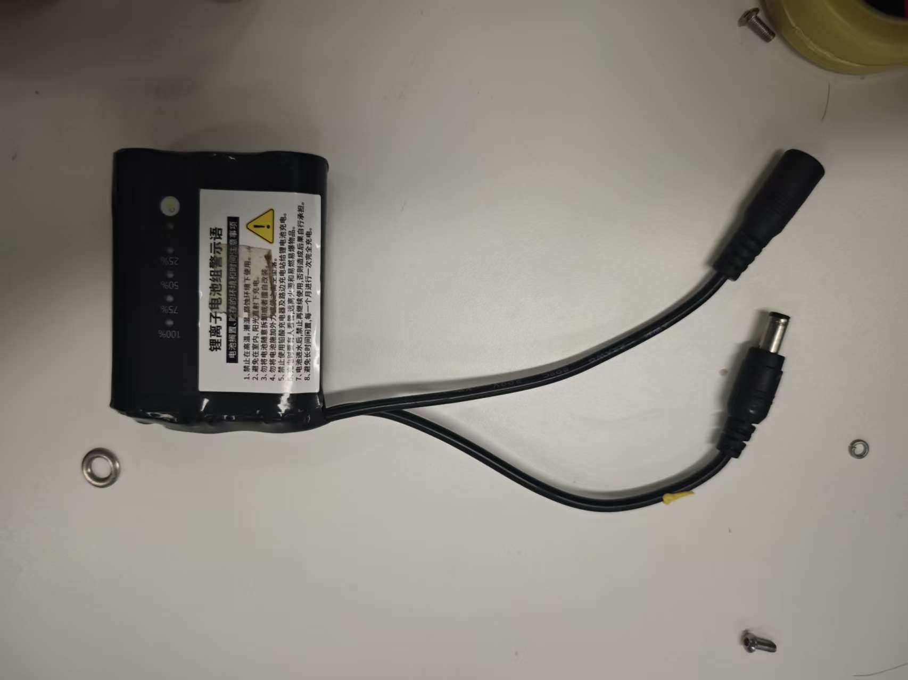
电源模块：dc多路电源转换模块
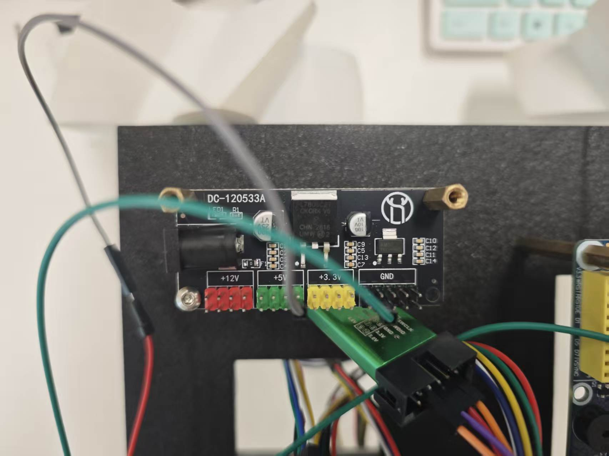
麦克娜姆轮第一版：
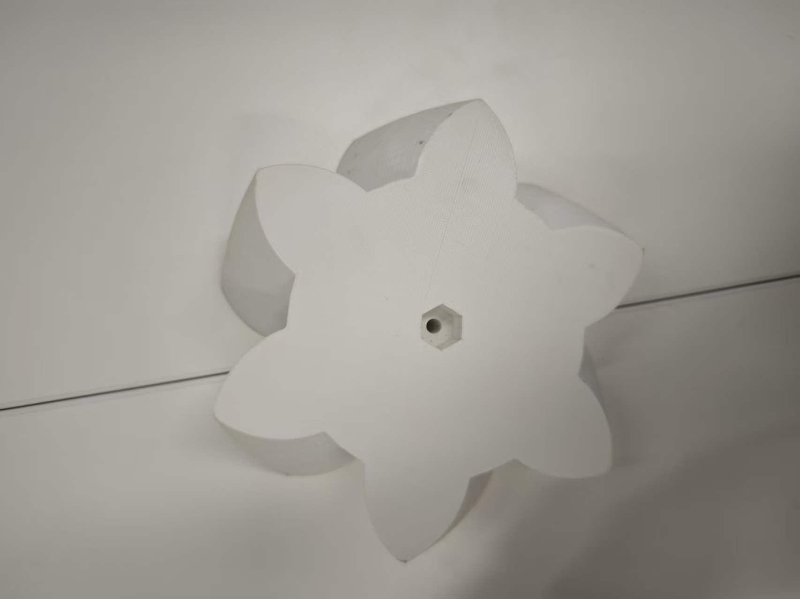
麦克娜姆轮第二版：
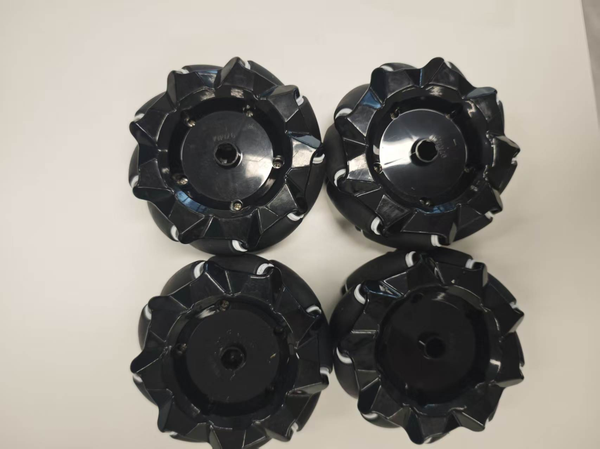
接线图手稿：
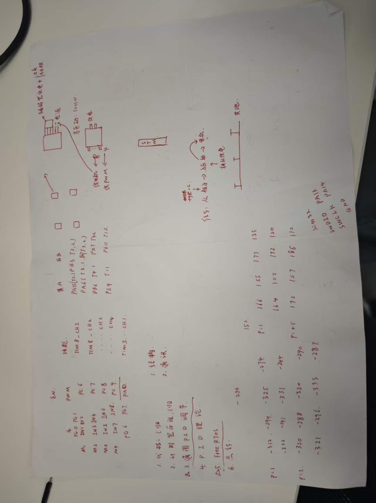
麦克娜姆轮轮子朝向推导
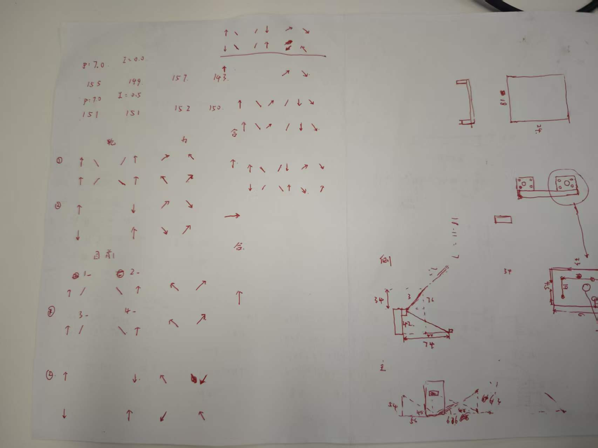
车架：
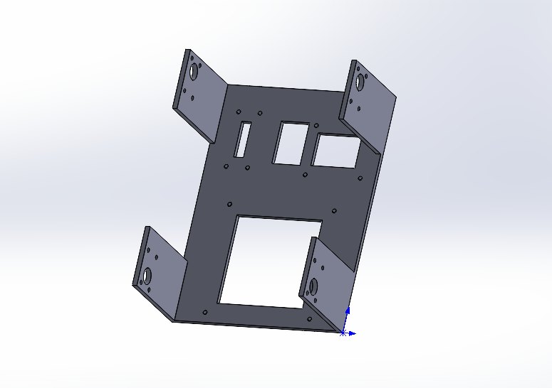
第一版成型的小车

第二版成型的小车
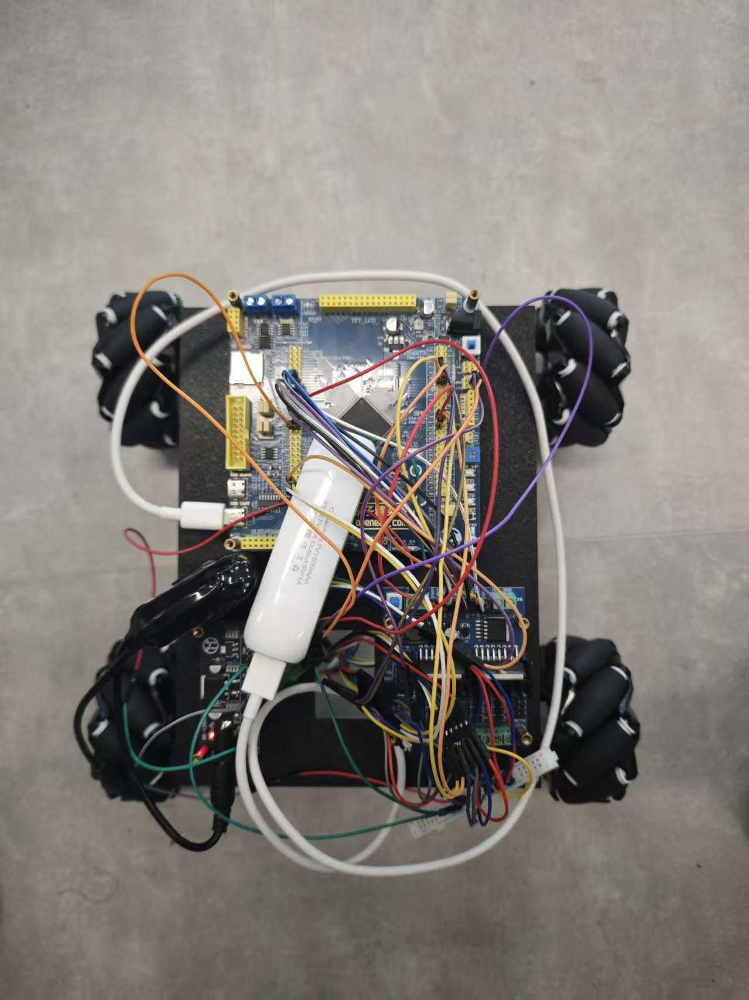
第一版的视频
[视频](../图片层/第一版小车动起来.mp4)
## 测试记录

| 测试内容 | 结果 | 备注 |
| --- | --- | --- | --- |
| 四路 PWM 输出 | 待补充 | 记录 PWM 范围和占空比 |
| 四电机方向 | 待补充 | 记录每个电机方向是否一致 |
| 编码器测速 | 待补充 | 记录转速、计数和误差 |

## 重新导入工程

在 STM32CubeIDE 中选择 `File -> Import -> Existing Projects into Workspace`，选择当前目录，导入 `.project` 文件对应的工程即可。重新生成 CubeMX 代码前，确认自己的代码位于 `USER CODE` 区域或独立的业务文件中。
# 2026.8.28
## 梳理之前做的事情
- [√] 四路 PWM 输出
- [√] 四个电机的方向控制
- [√] 编码器初始化和计数
- [x] 基础速度计算
- [√] 串口启动提示或数据输出
- [√] FreeRTOS 任务框架
- [√] 记录完整接线图
- [√] 记录 PWM 频率和定时器时钟参数
- [√] 记录每个电机的编码器计数方向
- [√] 完善速度闭环测试
- [√] 增加串口调参
